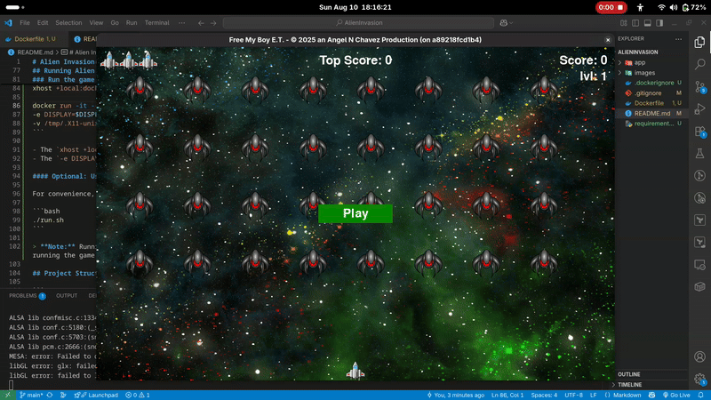

# Alien Invasion(Currently in Early Stages of Development)

My take on a classic arcade-style space shooter game built with Python and Pygame, following the project from **Python Crash Course (3rd Edition)** by Eric Matthes.

## About the Game

Space Invaders is a 2D side-scrolling shooter where you control a spaceship defending Earth from waves of invading aliens. The game demonstrates fundamental game development concepts including sprite collision detection, game states, scoring systems, and progressive difficulty scaling.

## Features(Once Completed)

- **Player Controls**: Smooth ship movement with keyboard input
- **Dynamic Shooting**: Fire bullets to destroy alien invaders
- **Alien Fleet**: Organized formations of aliens that move and descend
- **Collision Detection**: Realistic interactions between bullets, aliens, and the player ship
- **Progressive Difficulty**: Game speed and alien behavior intensify with each level
- **Scoring System**: Points awarded for destroying aliens
- **High Score Tracking**: Persistent high score storage using JSON
- **Multiple Lives**: Player gets multiple chances before game over
- **Game States**: Start screen, active gameplay, and game over states
- **Sound Effects**: Audio feedback for shooting and collisions (if implemented)

## Technical Implementation

### Core Components

- **Ship Class**: Handles player ship rendering, movement, and positioning
- **Bullet Class**: Manages bullet creation, movement, and lifecycle
- **Alien Class**: Controls individual alien behavior and rendering  
- **Game Stats**: Tracks score, lives, level, and game state
- **Settings**: Centralized configuration for game parameters
- **Button Class**: Interactive UI elements for game control

### Key Programming Concepts Demonstrated

- Object-oriented programming with classes and inheritance
- Game loop architecture with event handling
- Sprite groups for efficient collision detection
- File I/O for persistent data storage
- Game state management
- Dynamic difficulty adjustment algorithms

## Installation & Requirements

### Prerequisites
- Python 3.6 or higher
- Pygame library

### Setup
```bash
# Install Pygame
pip install pygame

# Clone or download the project files
# Navigate to the project directory
# Run the game
python alien_invasion.py
```

## How to Play

1. **Start Game**: Click the "Play" button or press 'P'
2. **Movement**: Use arrow keys to move your ship left and right
3. **Shooting**: Press spacebar to fire bullets at the alien fleet
4. **Objective**: Destroy all aliens to advance to the next level
5. **Lives**: You have 3 ships - losing all ships ends the game
6. **Scoring**: Each alien destroyed adds to your score

## Game Controls

| Key | Action |
|-----|--------|
| ← → | Move ship left/right |
| Spacebar | Fire bullets |
| P | Start new game |
| Q | Quit game |

## Running Alien Invasion with Docker

You can run this game in a Docker container on Linux.

### Run the game

```bash
xhost +local:docker

docker run -it --rm \
-e DISPLAY=$DISPLAY \
-v /tmp/.X11-unix:/tmp/.X11-unix \itanc12/free-et
```

- The `xhost +local:docker` command allows Docker containers to access your display.
- The `-e DISPLAY` and `-v /tmp/.X11-unix:/tmp/.X11-unix` options let the container open the game window on your desktop.

#### Optional: Use a helper script

For convenience, you can create a `run.sh` script with the above commands and run:

```bash
./run.sh
```

> **Note:** Running GUI apps in Docker on Windows or Mac requires extra setup (like XQuartz or VcXsrv). For most users on those platforms, running the game natively is easier.

## Project Structure

```
AlienInvasion/
├── app/
│   ├── alien_invasion.py   # Main game file
│   ├── settings.py         # Game configuration
│   ├── ship.py             # Player ship class
│   ├── bullet.py           # Bullet mechanics
│   ├── alien.py            # Alien enemy class
│   ├── game_stats.py       # Score and game state tracking
│   ├── scoreboard.py       # Score display management
│   └── button.py           # UI button implementation
│
├── images/                 # Game sprites and graphics
│   ├── boss_ufo.png
│   ├── shuttle2.png
│   ├── space1.jpg
│   ├── ufo1.png
│   └── ufo3.png
├── Dockerfile              # Docker build instructions
├── requirements.txt        # Python dependencies
├── .dockerignore           # Docker ignore rules
└── README.md               # Project documentation
```

## Learning Objectives

This project teaches essential programming concepts including:

- **Game Development Fundamentals**: Understanding game loops, frame rates, and real-time user input
- **Object-Oriented Design**: Creating modular, reusable classes with clear responsibilities
- **Event-Driven Programming**: Handling user input and system events
- **Data Persistence**: Saving and loading game data using JSON
- **Algorithm Implementation**: Collision detection and game logic
- **Code Organization**: Structuring larger projects across multiple files

## Customization Ideas

- Add power-ups and special weapons
- Implement different alien types with varying behaviors
- Create animated sprites and particle effects
- Add background music and enhanced sound effects
- Design multiple levels with unique challenges
- Implement multiplayer functionality
- Add boss enemies and special encounters

## Credits

Based on the Alien Invasion project from **Python Crash Course (3rd Edition)** by Eric Matthes, published by No Starch Press. This project serves as an my introduction to game development with Python and demonstrates practical applications of programming fundamentals in an engaging, interactive way.

## Demo

